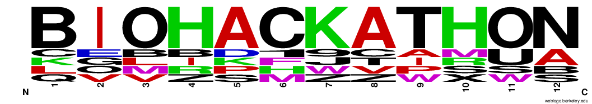
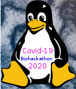

# covid-19-bh20

Over the internet we are organizing the *COVID-19 Biohackathon April
5-11 2020*!

# Goals

The goal of COVID-19-BH20 is to create a cohesive effort and work on
tooling for COVID-19 analysis. The biohackathon will lead to more
readily accessible data, protocols, detection kits, protein
predictions etc.

We will also push for policy change where it comes to non-public or
hard to access data because we are facing such challenges!

# Free software, free data

The biohackathon is about applying free and open source software on
open data for scientific endeavour and biomedical progress.

# When?

The biohackathon wil run from April 5th-11th 2020. Before that time
working groups will start preparations. After the biohackathon
collaborations often continue.

# How?

Over the internet we are forming groups with
[topics](https://github.com/virtual-biohackathons/covid-19-bh20/wiki)
to work on. There will be working groups for FAIR data, workflows and
pipelines, pangenomes and variation graphs, machine learning, text
mining and visualisations. You can create your own group and get
people interested in your area of work. We will use video
conferencing, E-mail, IRC, messaging, wiki's and source code
repositories to make it all happen.

# Examples

A concrete outcome is that if someone sequences a new patient they
should be able to immediately compare it with all other known strains
in a variation graph/pangenome. Standardized FAIR (metadata) and
public repositories of (raw) data - that people can contribute to - as
well as workflows that can be run by anyone (in the cloud) are
all concrete outcomes.

The following wiki page lists known [resources](https://github.com/virtual-biohackathons/covid-19-bh20/wiki/Resources).

# Who?

Anyone can join and contribute. Thanks to the annual biohackathons in
Japan and Europe we already have an experienced community. One benefit
of this virtual biohackathon is that we can expand and be as inclusive
as possible. Even if you are a student and not so experienced you can
sign-up and contribute! All hands are welcome!

To participate sign up [here](https://docs.google.com/spreadsheets/d/1auS0C58W0KHuqPg7-qKzgO4QjvcXpRg2NxhPu9EcWfI/edit), become a member of
the [mailing list](https://groups.google.com/forum/#!forum/virtual-biohackathon) and add to the [wiki](https://github.com/virtual-biohackathons/covid-19-bh20/wiki)!

# Code of conduct

Anyone participating agrees to abide by the code of conduct as given
by [FOSDEM 2020](https://fosdem.org/2020/practical/conduct/). Here,
please bring any concerns to the immediate attention of our
coordinating team:

# Coordinating team

1. Pjotr Prins, USA (pjotr.public708@thebird.nl)
2. [Tazro Ohta](https://github.com/inutano), Japan (t.ohta@dbcls.rois.acjp)
3. Leyla Garcia, Germany

# Contribute

Contribute by added and/or signing up to ideas on the Biohackathon
[Wiki](https://github.com/virtual-biohackathons/covid-19-bh20/wiki). You can also edit these pages and send a pull request.

# Contact

Sign up with the [mailing list](https://groups.google.com/forum/#!forum/virtual-biohackathon) and ask!

